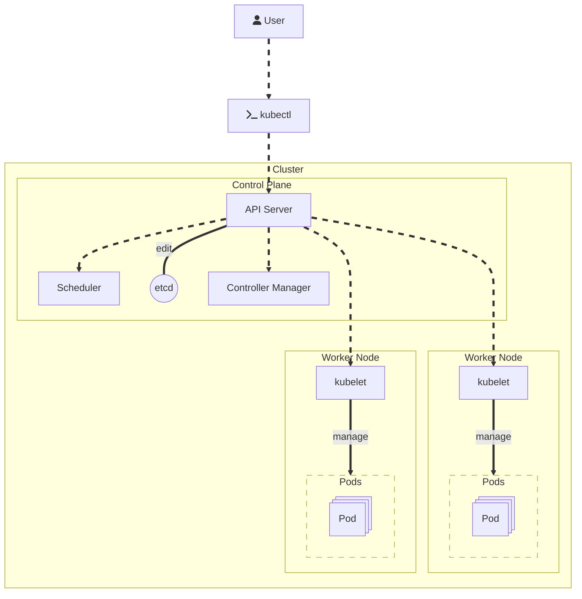

```mermaid
flowchart TB

    User["fa:fa-user User"]
    kubectl["fa:fa-terminal kubectl"]
 
    subgraph Cluster
        direction TB
        subgraph ControlPlane["Control Plane"]
            API[API Server] c3@==> Scheduler
            API ===|edit| etcd((etcd))
            API c4@==> ControllerManager["Controller Manager"]
        end
        subgraph WorkerNode["Worker Node"]
            kubelet["kubelet"]
            subgraph PodsContainer["Pods"]
              direction LR
              Pod@{ shape: st-rect, label: "Pod"}
            end
            kubelet ===>|manage| PodsContainer
        end
        subgraph WorkerNodeN["Worker Node"]
            kubeletN["kubelet"]
            subgraph PodsContainerN["Pods"]
              direction LR
              PodN@{ shape: st-rect, label: "Pod"}
            end
            kubeletN ===>|manage| PodsContainerN
        end
    end

    User c1@===> kubectl c2@==> API
    API c5@===> kubelet
    API c5N@===> kubeletN

    classDef animate stroke-dasharray: 9,5,stroke-dashoffset: 900,animation: dash 50s linear infinite;
    class c1,c2,c3,c4,c5,c5N animate

    class PodsContainer,PodsContainerN structurevarint
    classDef structurevarint stroke-dasharray: 9,5,stroke-dashoffset: 900,animation: dash 50s linear infinite, corners: round;

    click kubectl / "kubectl is the main interface for interacting with Kubernetes. It sends commands to the cluster via the Kubernetes API. You can use it to:\n<ul>\n<li>Deploy applications</li>\n<li>View resources (like pods)</li>\n<li>Update or delete things in the cluster</li>\n</ul>"

    click User / "The user interacts with the Kubernetes cluster through the kubectl command-line tool. They can perform various operations such as deploying applications, managing resources, and monitoring cluster state."

    click API / "The API Server is the central management entity that exposes the Kubernetes API. It processes REST requests, validates them, and updates the corresponding objects in etcd. It also serves as the communication hub for other control plane components."

    click etcd / "etcd is a distributed key-value store that Kubernetes uses to store all cluster data. It holds the state of the cluster, including information about nodes, pods, services, and more."

    click Scheduler / "The Scheduler is responsible for assigning pods to nodes. It watches for newly created pods that have no assigned node and selects an appropriate node for them based on resource availability and other constraints."

    click ControllerManager / "The Controller Manager runs various controllers that manage the state of the cluster. These controllers ensure that the desired state of the cluster matches the actual state."

    click kubelet / "The kubelet is an agent that runs on each worker node. It ensures that the containers described in the PodSpecs are running and healthy. The kubelet communicates with the API Server to receive instructions and report node and pod status."

    click Pod / "A Pod is the smallest deployable unit in Kubernetes. It represents a single instance of a running process in the cluster. A Pod can contain one or more containers, which share the same network and storage."
```